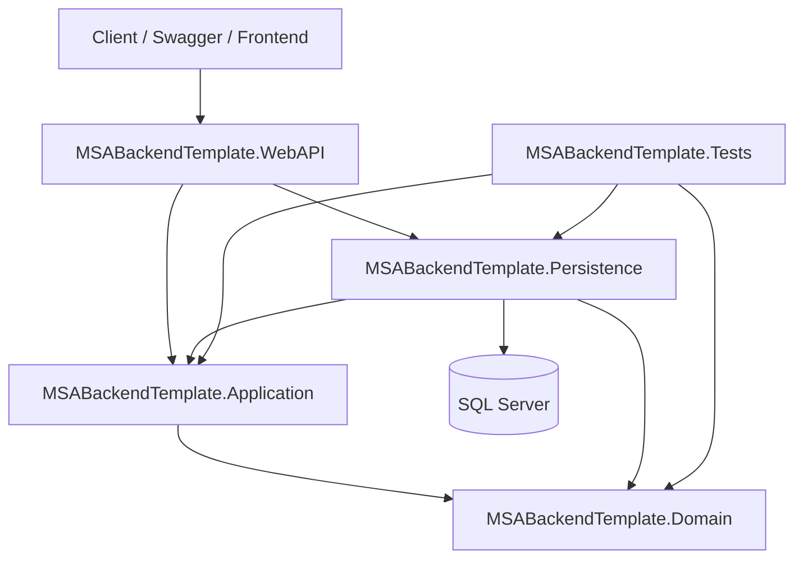

# MSABackendTemplate

<p align="center">
  
</p>

<p align="center">
  
  
  
  
  
</p>

---

## İçindekiler

- [Nedir?](#nedir)
- [Ne Amaçla Yazıldı?](#ne-amaçla-yazıldı)
- [Öne Çıkan Özellikler](#öne-çıkan-özellikler)
- [Teknoloji Yığını](#teknoloji-yığını)
- [Mimari Yaklaşım](#mimari-yaklaşım)
- [Proje Yapısı](#proje-yapısı)
- [Katmanların Sorumlulukları](#katmanların-sorumlulukları)
- [Kurulum](#kurulum)
- [Konfigürasyon](#konfigürasyon)
- [Veritabanı Kurulumu](#veritabanı-kurulumu)
- [Projeyi Çalıştırma](#projeyi-çalıştırma)
- [API Kullanım Kılavuzu](#api-kullanım-kılavuzu)
- [Authentication Akışı](#authentication-akışı)
- [Product API Akışı](#product-api-akışı)
- [Health Check Endpointleri](#health-check-endpointleri)
- [Testler](#testler)
- [Yeni Modül Ekleme Rehberi](#yeni-modül-ekleme-rehberi)
- [Production Notları](#production-notları)
- [Bilinen Sınırlar](#bilinen-sınırlar)
- [Geliştirme Yol Haritası](#geliştirme-yol-haritası)

---

## Nedir?

**MSABackendTemplate**, modern bir ASP.NET Core backend projesi başlatmak için hazırlanmış, katmanlı mimari prensiplerini izleyen bir backend başlangıç şablonudur.

Bu proje; authentication, validation, response standardizasyonu, logging, rate limiting, health check, repository, unit of work, caching ve test altyapısı gibi backend geliştirmede sık kullanılan temel yapı taşlarını tek bir referans çözüm içinde toplar.

Kısaca:

> Yeni bir backend projesine boş bir Web API template’iyle başlamak yerine, üretim ortamına daha yakın bir mimari iskeletle başlamak için tasarlanmıştır.

---

## Ne Amaçla Yazıldı?

Bu projenin amacı, küçük ve orta ölçekli backend projelerinde tekrar tekrar kurulması gereken altyapıyı standartlaştırmaktır.

Hedeflenen kullanım senaryoları:

- Yeni bir **ASP.NET Core Web API** projesine hızlı başlamak
- Clean Architecture / Onion Architecture mantığını pratik bir örnekle göstermek
- JWT tabanlı authentication akışını hazır almak
- Standart API response yapısı kullanmak
- FluentValidation ile request doğrulama yapmak
- Repository + Unit of Work yaklaşımını örneklemek
- Serilog ile merkezi loglama altyapısı kurmak
- Health check endpointleriyle sistem durumunu izlemek
- Rate limiting ile temel API koruması sağlamak
- xUnit, Moq ve FluentAssertions ile test edilebilir servis yapısı kurmak

Bu repo bir “final product” değil, **üzerine ürün inşa edilecek backend temelidir**.

---

## Öne Çıkan Özellikler

| Özellik | Açıklama |
|---|---|
| Clean Architecture | Domain, Application, Persistence, WebAPI ve Tests ayrımı |
| JWT Authentication | Register / login akışı ve Bearer token üretimi |
| ASP.NET Core Identity | Kullanıcı yönetimi için Identity altyapısı |
| Entity Framework Core | SQL Server bağlantısı ve DbContext yönetimi |
| Repository Pattern | Generic repository ve product repository yapısı |
| Unit of Work | Transaction yönetimi ve merkezi SaveChanges akışı |
| FluentValidation | DTO validation kurallarının application katmanında yönetimi |
| Standard Response Wrapper | `ServiceResult` / `ServiceResult<T>` ile tutarlı API cevapları |
| Action Result Factory | ServiceResult → IActionResult dönüşümünü merkezi yönetme |
| Serilog | Console ve file logging |
| Rate Limiting | Auth ve protected endpointler için limit politikaları |
| Health Checks | `/health`, `/health/ready`, `/health/live` endpointleri |
| In-Memory Cache | Product listeleri için cache örneği |
| Unit Tests | ProductService için mock tabanlı servis testleri |

---

## Teknoloji Yığını

### Backend

| Teknoloji | Kullanım |
|---|---|
| .NET 8 | Ana uygulama hedef framework’ü |
| ASP.NET Core Web API | HTTP API katmanı |
| Entity Framework Core | ORM ve SQL Server erişimi |
| ASP.NET Core Identity | Kullanıcı ve kimlik yönetimi |
| JWT Bearer Authentication | Token tabanlı authentication |
| FluentValidation | Request validation |
| AutoMapper | Entity / DTO dönüşümleri |
| Serilog | Structured logging |
| HealthChecks | Uygulama ve database sağlık kontrolleri |
| Rate Limiting | API trafik kontrolü |
| Swagger / Swashbuckle | API dokümantasyonu ve test arayüzü |

### Database

| Teknoloji | Kullanım |
|---|---|
| SQL Server | Ana veritabanı |
| SQL Server LocalDB | Varsayılan lokal geliştirme veritabanı |
| EF Core Migrations | Veritabanı şeması yönetimi için önerilen akış |

### Testing

| Teknoloji | Kullanım |
|---|---|
| xUnit | Unit test framework |
| Moq | Mock nesne üretimi |
| FluentAssertions | Okunabilir assertion yapısı |
| coverlet.collector | Test coverage için altyapı |

> Not: Ana uygulama projeleri `.NET 8.0` hedeflidir. Test projesi mevcut durumda `.NET 9.0` hedefliyorsa, testleri çalıştırmak için .NET 9 SDK gerekir. Daha sade bir geliştirme deneyimi için test projesi de `.NET 8.0` hedefine hizalanabilir.

---

## Mimari Yaklaşım

Proje, bağımlılıkların merkeze doğru aktığı klasik Clean Architecture yaklaşımını izler.



Temel prensip:

```text
Domain katmanı dış dünyayı bilmez.
Application iş akışını yönetir.
Persistence teknik implementasyonları taşır.
WebAPI sadece HTTP giriş noktasıdır.
```

---

## Proje Yapısı

```text
MSABackendTemplate/
├── MSABackendTemplate.Domain/
│   ├── Common/
│   └── Entities/
│
├── MSABackendTemplate.Application/
│   ├── DTOs/
│   ├── Interfaces/
│   ├── Parameters/
│   ├── Services/
│   ├── Validators/
│   └── Wrappers/
│
├── MSABackendTemplate.Persistence/
│   ├── Contexts/
│   ├── Repositories/
│   ├── Services/
│   └── UnitOfWork.cs
│
├── MSABackendTemplate.WebAPI/
│   ├── Controllers/
│   ├── Factories/
│   ├── Filters/
│   ├── Middlewares/
│   ├── Properties/
│   ├── appsettings.json
│   └── Program.cs
│
├── MSABackendTemplate.Tests/
│   └── Application/
│
└── MSABackendTemplate.sln
```

---

## Katmanların Sorumlulukları

### `MSABackendTemplate.Domain`

Domain katmanı, iş modelinin çekirdeğidir.

İçerir:

- Entity sınıfları
- Base entity
- Guard clause mantığı
- Domain davranışları

Örnek domain yaklaşımı:

```text
Product sadece veri tutan anemic bir model değildir.
Fiyat güncelleme, stok düşürme ve validasyon gibi davranışları kendi içinde taşır.
```

Bu yaklaşım, iş kurallarının rastgele servis veya controller içine dağılmasını engeller.

---

### `MSABackendTemplate.Application`

Application katmanı, business use-case’lerin merkezidir.

İçerir:

- DTO’lar
- Servis arayüzleri
- Application servisleri
- Validation kuralları
- Pagination parametreleri
- Response wrapper yapıları
- Repository abstraction’ları

Örnek servisler:

- `ProductService`
- `OrderService`

Bu katman, verinin nereden geldiğini bilmez; repository ve servis arayüzleri üzerinden çalışır.

---

### `MSABackendTemplate.Persistence`

Persistence katmanı teknik implementasyonları taşır.

İçerir:

- `ApplicationDbContext`
- EF Core repository implementasyonları
- Unit of Work implementasyonu
- ASP.NET Core Identity entegrasyonu
- JWT token generator
- Account service
- In-memory cache service
- Mock payment service

Bu katman, database, authentication provider, cache ve dış servisler gibi teknik detaylardan sorumludur.

---

### `MSABackendTemplate.WebAPI`

WebAPI katmanı HTTP giriş noktasıdır.

İçerir:

- Controller’lar
- Middleware’ler
- Validation filter
- Action result factory
- Swagger setup
- JWT authentication setup
- Rate limiting setup
- Health check endpointleri

Controller’ların amacı iş mantığı yazmak değil, request’i application servislerine yönlendirmektir.

---

### `MSABackendTemplate.Tests`

Test katmanı, application servislerinin davranışlarını izole şekilde doğrulamak için kullanılır.

Mevcut test yaklaşımı:

- Servis bağımlılıkları mock’lanır
- ProductService davranışları test edilir
- Cache hit / cache miss senaryoları doğrulanır
- Repository ve UnitOfWork çağrıları verify edilir

---

## Kurulum

### Gereksinimler

Minimum gereksinimler:

- Git
- .NET 8 SDK
- SQL Server LocalDB veya SQL Server
- Visual Studio 2022 / Rider / VS Code
- EF Core CLI aracı

EF Core CLI yoksa:

```bash
dotnet tool install --global dotnet-ef
```

Kuruluysa güncellemek için:

```bash
dotnet tool update --global dotnet-ef
```

---

### Repoyu Klonlama

```bash
git clone https://github.com/MuhammetSaitAkgunes/MSABackendTemplate.git
cd MSABackendTemplate
```

Bağımlılıkları yükle:

```bash
dotnet restore
```

Projeyi build et:

```bash
dotnet build
```

---

## Konfigürasyon

Ana konfigürasyon dosyası:

```text
MSABackendTemplate.WebAPI/appsettings.json
```

Varsayılan connection string:

```json
"ConnectionStrings": {
  "DefaultConnection": "Server=(localdb)\\mssqllocaldb;Database=MSABackendTemplateDB;Trusted_Connection=True;MultipleActiveResultSets=true"
}
```

JWT ayarları:

```json
"JwtSettings": {
  "Key": "change-this-key-for-production",
  "Issuer": "MSABackendTemplate",
  "Audience": "MSABackendTemplateUser",
  "DurationInMinutes": 60
}
```

### Kritik Güvenlik Notu

`JwtSettings:Key` değeri production ortamında kesinlikle repository içinde tutulmamalıdır.

Production için önerilen yöntemler:

- Environment variables
- User secrets
- Azure Key Vault
- AWS Secrets Manager
- Docker secrets
- CI/CD secret store

Lokal geliştirmede User Secrets kullanmak için:

```bash
cd MSABackendTemplate.WebAPI

dotnet user-secrets init

dotnet user-secrets set "JwtSettings:Key" "your-very-long-secure-development-key"
dotnet user-secrets set "JwtSettings:Issuer" "MSABackendTemplate"
dotnet user-secrets set "JwtSettings:Audience" "MSABackendTemplateUser"
dotnet user-secrets set "JwtSettings:DurationInMinutes" "60"
```

---

## Veritabanı Kurulumu

Varsayılan olarak SQL Server LocalDB kullanılır.

### 1. Migration Oluşturma

Eğer migration yoksa aşağıdaki komutla ilk migration oluşturulabilir:

```bash
dotnet ef migrations add InitialCreate \
  --project MSABackendTemplate.Persistence \
  --startup-project MSABackendTemplate.WebAPI \
  --context ApplicationDbContext
```

Windows PowerShell için:

```powershell
dotnet ef migrations add InitialCreate `
  --project MSABackendTemplate.Persistence `
  --startup-project MSABackendTemplate.WebAPI `
  --context ApplicationDbContext
```

### 2. Database Güncelleme

```bash
dotnet ef database update \
  --project MSABackendTemplate.Persistence \
  --startup-project MSABackendTemplate.WebAPI \
  --context ApplicationDbContext
```

Windows PowerShell için:

```powershell
dotnet ef database update `
  --project MSABackendTemplate.Persistence `
  --startup-project MSABackendTemplate.WebAPI `
  --context ApplicationDbContext
```

---

## Projeyi Çalıştırma

WebAPI projesine geç:

```bash
cd MSABackendTemplate.WebAPI
```

HTTPS profiliyle çalıştır:

```bash
dotnet run --launch-profile https
```

HTTP profiliyle çalıştır:

```bash
dotnet run --launch-profile http
```

Varsayılan launch ayarları:

| Profil | URL |
|---|---|
| HTTPS | `https://localhost:7118` |
| HTTP | `http://localhost:5087` |
| Swagger | `/swagger` |

Swagger arayüzü:

```text
https://localhost:7118/swagger
```

veya:

```text
http://localhost:5087/swagger
```

---

## API Kullanım Kılavuzu

API route formatı:

```text
/api/[controller]
```

Mevcut ana controller’lar:

| Controller | Amaç |
|---|---|
| `AuthController` | Register ve login işlemleri |
| `ProductsController` | JWT korumalı product işlemleri |

---

## Authentication Akışı

### Register

Yeni kullanıcı oluşturur.

```http
POST /api/Auth/register
Content-Type: application/json
```

Örnek request:

```json
{
  "firstName": "Muhammet",
  "lastName": "Akgunes",
  "email": "msa@example.com",
  "password": "StrongPass123!"
}
```

Beklenen sonuç:

```json
{
  "data": "generated-user-id",
  "isSuccess": true,
  "errors": []
}
```

---

### Login

Kullanıcı girişi yapar ve JWT token döner.

```http
POST /api/Auth/login
Content-Type: application/json
```

Örnek request:

```json
{
  "email": "msa@example.com",
  "password": "StrongPass123!"
}
```

Örnek response:

```json
{
  "data": {
    "token": "jwt-token",
    "email": "msa@example.com",
    "firstName": "Muhammet",
    "lastName": "Akgunes"
  },
  "isSuccess": true,
  "errors": []
}
```

Swagger’da protected endpointleri test etmek için:

```text
Authorize → Bearer {token}
```

Header formatı:

```http
Authorization: Bearer jwt-token
```

---

## Product API Akışı

`ProductsController`, JWT gerektirir.

```text
[Authorize]
```

Ayrıca fixed rate limiting politikasına bağlıdır.

```text
100 request / minute
```

### Tüm Ürünleri Listeleme

```http
GET /api/Products
Authorization: Bearer {token}
```

Bu endpoint cache desteklidir. Product listesi cache’te varsa database’e gitmeden döner.

---

### Sayfalı, Filtreli ve Sıralı Listeleme

```http
GET /api/Products/paged?pageNumber=1&pageSize=10&searchTerm=laptop&sortBy=name&sortOrder=asc
Authorization: Bearer {token}
```

Örnek query parametreleri:

| Parametre | Açıklama |
|---|---|
| `pageNumber` | Sayfa numarası |
| `pageSize` | Sayfa boyutu |
| `searchTerm` | Ürün adı/açıklamasında arama |
| `sortBy` | Sıralanacak alan |
| `sortOrder` | `asc` veya `desc` |

---

### Id ile Ürün Getirme

```http
GET /api/Products/{id}
Authorization: Bearer {token}
```

Ürün bulunamazsa standart hata cevabı döner.

---

### Ürün Oluşturma

```http
POST /api/Products
Authorization: Bearer {token}
Content-Type: application/json
```

Örnek request:

```json
{
  "name": "Gaming Laptop",
  "description": "High performance laptop",
  "price": 1500,
  "stock": 10
}
```

Başarılı olursa `201 Created` döner.

---

## Health Check Endpointleri

Uygulama üç temel health endpoint sunar.

| Endpoint | Amaç |
|---|---|
| `/health` | Genel health check |
| `/health/ready` | Readiness probe |
| `/health/live` | Liveness probe |

Örnek:

```http
GET /health
```

Kubernetes / container ortamı için önerilen ayrım:

```text
/health/live  → Uygulama ayakta mı?
/health/ready → Uygulama istek almaya hazır mı?
```

---

## Logging

Serilog yapılandırması `appsettings.json` içinde bulunur.

Varsayılan davranış:

- Console logging
- Günlük dosya bazlı file logging

Log dosyaları:

```text
MSABackendTemplate.WebAPI/Logs/log-.txt
```

Production ortamında öneriler:

- Structured JSON logs
- Centralized logging
- Correlation ID
- Request ID
- User ID / tenant ID enrichment
- Log level ayrımı

---

## Rate Limiting

Projede üç rate limiting politikası yapılandırılmıştır:

| Policy | Amaç |
|---|---|
| `fixed` | Protected endpointlerde standart limit |
| `sliding` | Daha sıkı trafik kontrolü için hazır politika |
| `auth` | Login/register gibi auth endpointleri için token bucket |

Mevcut kullanım:

- `AuthController` → `auth`
- `ProductsController` → `fixed`

Rate limit aşıldığında `429 Too Many Requests` döner.

---

## Standart Response Modeli

Servisler doğrudan `IActionResult` dönmez. Bunun yerine application katmanında standart result modeli kullanılır:

```csharp
ServiceResult
ServiceResult<T>
```

Temel response şekli:

```json
{
  "data": {},
  "isSuccess": true,
  "errors": []
}
```

Hatalı örnek:

```json
{
  "isSuccess": false,
  "errors": [
    "Product not found."
  ]
}
```

`StatusCode`, API response body içinde gösterilmez; controller tarafında HTTP status code üretmek için kullanılır.

---

## Validation

Validation akışı:

```text
Request DTO
    ↓
FluentValidation
    ↓
ValidationFilter
    ↓
ServiceResult.Failure(...)
    ↓
400 Bad Request
```

Bu yaklaşım sayesinde controller içine manuel validation kodu yazılmaz.

---

## Caching

Product listesi için in-memory cache örneği bulunur.

Akış:

```text
GET /api/Products
    ↓
Cache kontrolü
    ↓
Cache hit  → cache’ten dön
Cache miss → database → DTO map → cache set
```

Ürün oluşturulduğunda product cache invalidation yapılır.

---

## Transaction / Unit of Work

`OrderService`, Unit of Work pattern ile transaction yönetimini örnekler.

Örnek işlem akışı:

```text
1. Transaction başlat
2. Product kontrolü yap
3. Stok düş
4. Order oluştur
5. Database değişikliklerini kaydet
6. Payment service çağır
7. Payment başarılıysa commit
8. Payment başarısızsa rollback
```

Bu yapı, birden fazla repository ve dış servis içeren use-case’lerde tutarlılığı korumak için örneklenmiştir.

---

## Testler

Testleri çalıştırmak için:

```bash
dotnet test
```

Belirli test projesi için:

```bash
dotnet test MSABackendTemplate.Tests/MSABackendTemplate.Tests.csproj
```

Coverage toplamak için:

```bash
dotnet test --collect:"XPlat Code Coverage"
```

Mevcut test yaklaşımı:

- `ProductService` izole test edilir
- Repository mock’lanır
- UnitOfWork mock’lanır
- AutoMapper mock’lanır
- Cache service mock’lanır
- Cache hit / miss davranışları doğrulanır
- CreateProduct akışında `SaveChangesAsync` ve cache invalidation kontrol edilir

Önerilen sonraki testler:

- Auth integration tests
- Product API integration tests
- EF Core repository tests
- Testcontainers ile gerçek SQL Server testleri
- Error middleware tests
- Validation filter tests

---

## Yeni Modül Ekleme Rehberi

Yeni bir domain modülü eklemek için önerilen akış:

### 1. Domain Entity Oluştur

```text
MSABackendTemplate.Domain/Entities/Customer.cs
```

Entity içinde temel iş kurallarını ve davranışları tut.

---

### 2. DTO Tanımla

```text
MSABackendTemplate.Application/DTOs/CustomerDto.cs
MSABackendTemplate.Application/DTOs/CreateCustomerDto.cs
```

---

### 3. Validation Ekle

```text
MSABackendTemplate.Application/Validators/CreateCustomerDtoValidator.cs
```

---

### 4. Repository Interface Ekle

```text
MSABackendTemplate.Application/Interfaces/Repositories/ICustomerRepository.cs
```

---

### 5. Repository Implementasyonu Yaz

```text
MSABackendTemplate.Persistence/Repositories/CustomerRepository.cs
```

---

### 6. Application Service Yaz

```text
MSABackendTemplate.Application/Interfaces/ICustomerService.cs
MSABackendTemplate.Application/Services/CustomerService.cs
```

---

### 7. Dependency Injection Kaydı Ekle

Application:

```csharp
services.AddScoped<ICustomerService, CustomerService>();
```

Persistence:

```csharp
services.AddScoped<ICustomerRepository, CustomerRepository>();
```

---

### 8. Controller Ekle

```text
MSABackendTemplate.WebAPI/Controllers/CustomersController.cs
```

Controller mümkün olduğunca ince tutulmalıdır:

```csharp
[Authorize]
public class CustomersController : BaseApiController
{
    private readonly ICustomerService _customerService;

    public CustomersController(ICustomerService customerService)
    {
        _customerService = customerService;
    }

    [HttpGet]
    public async Task<IActionResult> GetAll()
    {
        return CreateActionResult(await _customerService.GetAllAsync());
    }
}
```

---

### 9. Migration Oluştur

```bash
dotnet ef migrations add AddCustomerModule \
  --project MSABackendTemplate.Persistence \
  --startup-project MSABackendTemplate.WebAPI \
  --context ApplicationDbContext
```

---

### 10. Test Yaz

```text
MSABackendTemplate.Tests/Application/Services/CustomerServiceTests.cs
```

---

## Production Notları

Bu template production’a yakın bir başlangıç sağlar; ancak doğrudan production’a alınmadan önce aşağıdaki başlıklar tamamlanmalıdır.

### Güvenlik

- JWT secret repository içinde tutulmamalı
- HTTPS zorunlu olmalı
- CORS politikası açıkça tanımlanmalı
- Refresh token akışı eklenmeli
- Role / permission bazlı authorization detaylandırılmalı
- Password policy ürün ihtiyacına göre gözden geçirilmeli
- Sensitive logging engellenmeli

### Observability

- Correlation ID middleware eklenmeli
- OpenTelemetry tracing eklenmeli
- Metrics export eklenmeli
- Centralized log provider kullanılmalı
- Request/response telemetry standardize edilmeli

### Database

- Migration stratejisi netleştirilmeli
- Seed data gerekiyorsa kontrollü eklenmeli
- Transaction boundary’leri use-case bazlı incelenmeli
- Index ve query performansı takip edilmeli

### Deployment

- Dockerfile eklenmeli
- docker-compose.yml eklenmeli
- GitHub Actions CI/CD eklenmeli
- Environment bazlı config ayrıştırılmalı
- Health check endpointleri deployment pipeline’a bağlanmalı

---

## Bilinen Sınırlar

Bu repo bilinçli olarak bir starter template seviyesindedir.

Mevcut sınırlar:

- Dockerfile yok
- docker-compose.yml yok
- CI/CD pipeline yok
- Integration test altyapısı yok
- Refresh token akışı yok
- Role/permission yönetimi sınırlı
- OrderService mevcut olsa da controller katmanı genişletilmeye açık
- In-memory cache production distributed cache yerine geçmez
- JWT secret sample config içindedir; production için taşınmalıdır
- Test target framework’ü uygulama projeleriyle hizalanmalıdır


Bu noktada kullanıcının tercihleri belirleyici olacaktır. Proje sadece bir başlangıç şablonu olarak üretilmiştir.

---

## Kısa Teknik Özet

```text
MSABackendTemplate, .NET 8 tabanlı, Clean Architecture yaklaşımıyla hazırlanmış,
JWT authentication, Identity, EF Core, SQL Server, FluentValidation, Serilog,
Rate Limiting, Health Checks, Repository, Unit of Work, In-Memory Cache ve xUnit
test altyapısı içeren production-oriented backend starter template’idir.
```

---

<p align="center">
  
</p>
